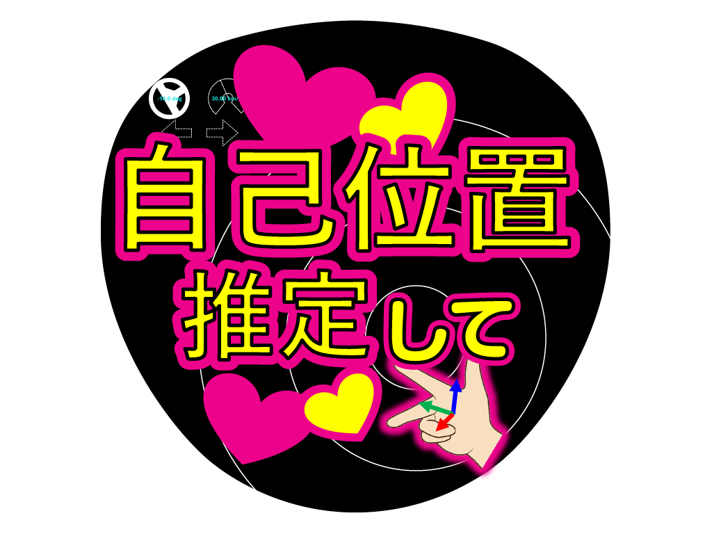
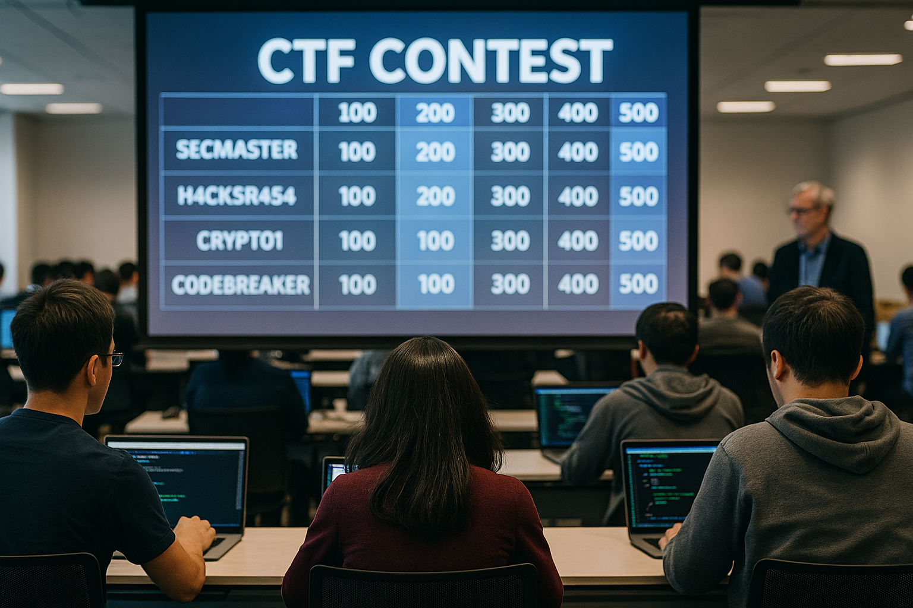

<header style="background: url('./images/challenge-club-backpanel.png') center/cover no-repeat; color: white; text-align: center; padding: 4rem 1rem; font-weight: bold; position: relative;" id="top">
  <h1>技術チャレンジ部</h1>
  
探究とつながりで、未来をつくる。

</header>
<section id="about">
  <h2>技術チャレンジ部とは？</h2>
  
<strong>成長の場の相互提供</strong>をコンセプトとした、有志による技術コミュニティです。

  
メーカー社員数名による小さな部活動として始まった取り組みは、今では社内外に広がり、300名を超える仲間が集うコミュニティへと成長しました。

  
こんな人たちが集まっています：

  <ul>
    <li>新しいことに挑戦してみたい</li>
    <li>技術をもっと深めたい</li>
    <li>刺激し合える仲間とつながりたい</li>
    <li>一人ではくじけそうでも、仲間となら走り続けられる</li>
  </ul>
  
そんな想いを持つメンバーが集まり、<strong>学び合い、刺激し合い、共に楽しむ──本気で遊ぶ技術者たちの「挑戦の場」</strong>です。

</section>

<section id="activities">
  <h2>活動内容</h2>
  

    <a href="https://github.com/ChallengeClub/vr-meetups" target="_blank" class="card">
      
      

        <h3>VR活動</h3>
        
定例会や体験会で、VRやメタバースに触れる活動を展開

      

    </a>
    <a href="{{ '/activities/programming_contest/' | url }}" target="_blank" class="card">
      
      

        <h3>挑戦！プログラミングコンテスト</h3>
        
コンテスト挑戦を通じてスキルアップ

      

    </a>
    <a href="{{ '/activities/automotive_ai_challenge/' | url }}" target="_blank" class="card">
      
      

        <h3>自動運転AIチャレンジ</h3>
        
実車や仮想環境での自動運転開発に挑戦

      

    </a>
    <a href="{{ '/activities/automotive_uxchallenge/' | url }}" target="_blank" class="card">
      
      

        <h3>自動運転UX創造チャレンジ</h3>
        
UX視点で自動運転の未来像を提案

      

    </a>
    <a href="{{ '/activities/makerfaire/' | url }}" target="_blank" class="card">
      
      

        <h3>MakerFaireTokyo2024出展</h3>
        
日本最大のメイカーイベントに出展

      

    </a>
    <a href="{{ '/activities/isucon/' | url }}" target="_blank" class="card">
      
      

        <h3>ISUCON参加</h3>
        
限界に挑むWEB高速化バトルに参戦

      

    </a>
    <a href="https://bukkowathon.challenge-club.org/" target="_blank" class="card">
      
      

        <h3>5h Bukkowathon</h3>
        
５時間で「ぶっ壊す」「ハッカソン」を開催

      

    </a>
    <a href="{{ '/activities/ctf/' | url }}" target="_blank" class="card">
      
      

        <h3>CTFコンテスト</h3>
        
セキュリティの力試し！CTF大会に参加

      

    </a>
    <a href="https://challenge-club.connpass.com/" target="_blank" class="card">
      
      

        <h3>connpassのLT会</h3>
        
社外公開型の勉強会をconnpassで開催

      

    </a>
  

</section>

<section id="contact">
  <h2>お問い合わせ</h2>
  

    <a href="https://forms.office.com/Pages/ResponsePage.aspx?id=1vVjSGBHiUW-nEL4LgdXOZjcR3aRbtpEqTgZNLVVwCBUM1VIUTVaUFBMSlJCMElNTjhESk82N0YwWC4u" target="_blank" rel="noopener" style="display:inline-block;padding:0.5rem 1rem;background:var(--main-color);color:white;text-decoration:none;border-radius:4px;">お問い合わせはこちら</a>
  

  

    
Follow us:

    

      

        <a href="https://challenge-club.connpass.com/" target="_blank">
          
          
<strong>Connpass</strong>

        </a>
      

      

        <a href="https://github.com/ChallengeClub" target="_blank">
          
          
<strong>GitHub</strong>

        </a>
      

      

        <a href="https://www.youtube.com/@challenge_club4898" target="_blank">
          
          
<strong>YouTube</strong>

        </a>
      

      

        <a href="mailto:contact@challenge-club.org">
          
          
<strong>メール</strong>

        </a>
      

    

  </section>

