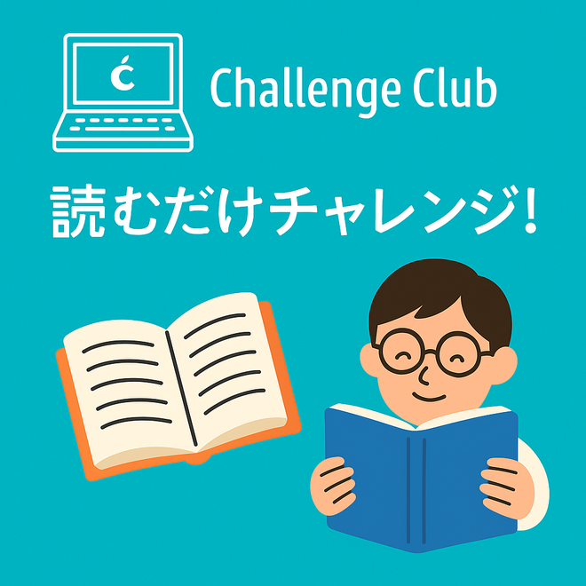

# 「もくもく読書会」始めました

新しい定例イベント「もくもく読書会」をスタートしました📚  
「ゆるーい読書会です。何を読んでもOK、話さなくてもOK、自分のペースでOK！

毎週土曜の朝、Discordで開催しています。
興味があればぜひご参加ください。

## イベントの説明

[connpass challenge_club](https://challenge-club.connpass.com/)でも公開しています。

---
### 開催概要
- 会場: オンライン(Discord)
- 参加申込いただいた方にURLを公開します。
- 読書会の所要時間は 1時間です。
- 途中参加・途中退出OK！自分のペースでお気軽にどうぞ。

### グランドルール
- 参加している人をリスペクトしましょう！
- 読む本・読み方・感じ方は人それぞれ。多様性を楽しむ場です。
- リアクション多め、大歓迎！絵文字やスタンプ、:clapping_hands:や:thumbs_up:のチャットなどでのリアクションはモチベUPに:sparkles:
- アウトプットには「いいね！」を伝えましょう。  
  例：「面白そう！」「読んでみたい」「なるほど～」など、  
  一言コメントが大きな励みになります！
- 一方的な批判や否定はNGです。  
  あくまで「読書の時間を気軽に共有すること」が目的です。

### 読むものについて
- 読む本は自由！何でもOKです。  
  技術書／ビジネス書／自己啓発書／小説／マンガ などジャンル不問です。
- 電子書籍でも紙の本でもOK！

### 読書の流れ

#### 開始前にチャットで共有
「読む本のタイトル or 内容」を軽く投稿してください。  
例：「○○の設計思想（3章から）読みます」

#### 読書スタート！
読書中はボイスチャットに入室してください（聞き専OK）  
マイク・カメラはOFF、音楽や雑談もOFFで集中タイムです。

#### 終了5分前～アウトプットタイム
読んだ内容や感想・学びを1人最大1分で共有（短くてもOK）  
声が出せない方はチャットでの共有も歓迎です。

### その他のメモ
- 話すのが苦手でも大丈夫。アウトプットは一言でOK！
- 回によってはテーマ縛り会（例：技術書会）も検討中です。

### ゆるく、楽しく、続けることを大切に！
「読む時間を誰かと共有するだけ」で、新しい刺激や出会いが生まれるかもしれません。  
普段読まないジャンルや、考え方に出会えるチャンスです。  
一緒に “ゆるく学ぶ時間” を楽しみましょう！
